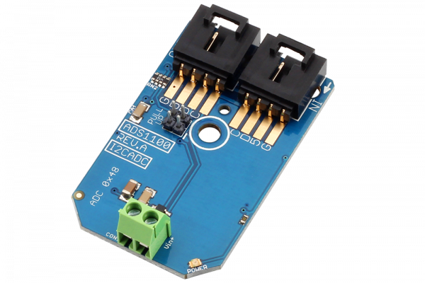

.

# ADS1100
ADS1100 is a 16-Bit 1-Channel Analog to Digital Converter I2C Mini Module.
This Device is available from www.ncd.io

[SKU: ADS1100_I2CS]

(https://store.ncd.io/product/ads1100-16-bit-1-channel-analog-to-digital-converter-i2c-mini-module/)

This Sample code can be used with Arduino.

Hardware needed to interface ADS1100 16-Bit 1-Channel Analog to Digital Converter with Arduino
1. <a href="https://store.ncd.io/product/i2c-shield-for-arduino-nano/">Arduino Nano</a>
2. <a href="https://store.ncd.io/product/i2c-shield-for-arduino-micro-with-i2c-expansion-port/">Arduino Micro</a>
3. <a href="https://store.ncd.io/product/i2c-shield-for-arduino-uno/">Arduino uno</a>
4. <a href="https://store.ncd.io/product/dual-i2c-shield-for-arduino-due-with-modular-communications-interface/">Arduino Due</a>
5. <a href="https://store.ncd.io/product/ads1100-16-bit-1-channel-analog-to-digital-converter-i2c-mini-module/">ADS1100 16-Bit 1-Channel Analog to Digital Converter</a>
6. <a href="https://store.ncd.io/product/i%C2%B2c-cable/">I2C Cable</a>

ADS1100 :

ADS1100 is a 1 Channel 16 bit resolution Analog to digital Converter. This ADC can be used as single or differential inputs analog to digital converter, signal channel differential analog to digital converter or single channel comparator. 
The ADC board has 2 address jumpers, which can be used to set upto 4 different I2C addresses. 

Applications:

● Portable instrumentation

● Industrial process control

● Smart transmitters

● Consumer goods

● Factory automation

● Temperature measurement

## Arduino
Download and install Arduino Software (IDE) on your machine. Steps to install Arduino are provided at:

https://www.arduino.cc/en/Main/Software

Download (or git pull) the code and double click the file to run the program.
Compile and upload the code on Arduino IDE and see the output on Serial Monitor.
How to Use the ADS1100 Arduino Library
The ADS1100 has a number of settings, which can be configured based on user requirements.
1. Gain Settings : ADS1115 supports upto 4 gain settings and these gain settings can be changed using this function

    ads.setGain(GAIN_ONE);          // 1x gain  (default)
    
2. Mode of Operation : ADS1100 has two mode of operation, one is Continuous conversion mode and other one is Power-down single-shot mode. If you are using this ADC in a battery powered application, you should use Power-down single-shot mode.
The mode of operation setting can be changed using this function

    ads.setMode(MODE_CONTIN);  
    
3. Sample rate : ADS1100 supports upto 128 SMPS settings, these settings can be changed based on number of sample required in a second. If you have a application where you need the data really quick in the minimum possible time you can use the higher number of samples setting. If you need high accuracy data without any time constraint, in that case you can use low SMPS setting. In general application you can keep the SMPS number in middle.
You can change the SMSP using this function

    ads.setRate(RATE_8);
 
 Reading ADS1100 in differential mode : To read the ADC input in differential mode you can use this function
 
    result = ads.Measure_Differential();
    
 In this setting you will need to connect your ADC input at channel 0. The ADS1100 will read the voltage at channel 0.
